  

  I solve big problems. The trends and tools change, but my role does not. 
  Austin, TX. Building web apps, mobile apps, and practical AI that ships.

---

### 🍝 Bugsy — self-hosted personal AI agent

A full-stack experiment in owning your own assistant. Bugsy runs on a hardened **GCP Compute Engine** VM provisioned with **Terraform** — no public IP, **Cloudflare Tunnel** for ingress, IAP-fallback firewall, narrow service-account scopes, GCS-backed snapshots. The runtime is **Docker Compose**: **n8n** for workflow orchestration, **Postgres + pgvector** for chat memory, **Qdrant** for RAG over personal knowledge, **Ollama** running `qwen3:8b` and `nomic-embed-text` locally, and **LiteLLM** brokering Claude / GPT / Gemini / local models through one OpenAI-compatible endpoint.

**Slack is the control panel.** Workflows handle inbox watching, lead research, RAG ingest/query, job-board scoring, web research via self-hosted SearXNG, and chat. Human-in-the-loop on anything that sends — reactions gate irreversible actions. The persona — a 1970s mafia-connected Italian-American — is half the fun and half a forcing function: an assistant with character is one I actually use.

> **Repo:** [`anthonycoffey/_agent`](https://github.com/anthonycoffey/_agent) · FOSS-first, CPU-only, hobby project

---

### Selected work

<table>
  <tr>
    <td width="50%" valign="top">
      <h4><a href="https://coffey.codes">coffey.codes</a></h4>
      This site. Next.js 16 · MDX · three.js · Tailwind v4. Where the writing lives.
    </td>
    <td width="50%" valign="top">
      <h4><a href="https://github.com/anthonycoffey/flutter-labelscan">flutter-labelscan</a></h4>
      Mobile app that scans price labels and tracks cart totals in real time. Dart / Flutter.
    </td>
  </tr>
  <tr>
    <td valign="top">
      <h4><a href="https://github.com/anthonycoffey/simply-voice">simply-voice</a></h4>
      Speech-to-text web app on Google Cloud Speech API. TypeScript · Firebase · Supabase.
    </td>
    <td valign="top">
      <h4><a href="https://github.com/anthonycoffey/easymark-ui">easymark-ui</a> + <a href="https://github.com/anthonycoffey/easymark-api">easymark-api</a></h4>
      Document annotation tool. React 19 frontend, FastAPI backend.
    </td>
  </tr>
  <tr>
    <td valign="top">
      <h4><a href="https://github.com/anthonycoffey/piano-scale-visualizer">piano-scale-visualizer</a></h4>
      Interactive scale explorer for music students. Web Audio API.
    </td>
    <td valign="top">
      <h4><a href="https://github.com/anthonycoffey?tab=repositories">More on GitHub →</a></h4>
      The rest of the workshop.
    </td>
  </tr>
</table>

---

### Stats

  
  

  
  

  

---

### Latest from [coffey.codes/articles](https://coffey.codes/articles)

<!-- BLOG-POST-LIST:START -->
- [Production-grade CI/CD with Next.js/Vercel and GitHub Actions](https://coffey.codes/articles/production-grade-ci-cd-with-nextjs-vercel-and-github-actions) Apr 24, 2026
- [Implementing Localization in a Next.js App](https://coffey.codes/articles/implementing-localization-in-nextjs) Feb 26, 2026
- [Fixing Broken Dynamic Routes After Upgrading to Next.js 16](https://coffey.codes/articles/fixing-broken-routes-after-nextjs-16-upgrade) Feb 01, 2026
- [Dealing with Slow Android Emulators in Flutter Development](https://coffey.codes/articles/slow-android-emulator-flutter-dev) Apr 16, 2025
- [Vibe Coding: Building a Flutter App Entirely with AI Prompts](https://coffey.codes/articles/vibe-coding-building-an-app-entirely-with-ai-prompts) Apr 03, 2025
<!-- BLOG-POST-LIST:END -->

---

### Stack

`TypeScript` · `React` · `Next.js` · `Node` · `Python` · `FastAPI` · `Flutter` · `React Native`
`Tailwind` · `Firebase` · `Supabase` · `Web Audio API` · `three.js`
`Terraform` · `Docker` · `n8n` · `Postgres` · `pgvector` · `Qdrant` · `LiteLLM` · `Cloudflare`

---

<a href="https://coffey.codes">coffey.codes</a>

